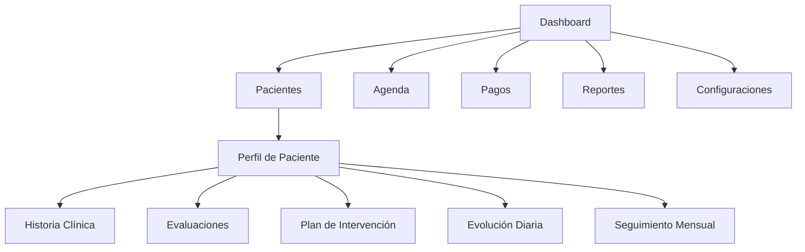

## 1. Product Overview
Dicere es un sistema de gestión terapéutica infantil diseñado para profesionales de la salud, que centraliza el seguimiento clínico, organización de pacientes, agenda y pagos en una plataforma moderna y clínicamente organizada.

- Resuelve la fragmentación de información en terapias infantiles, permitiendo a terapeutas acceder a expedientes completos y evolución clínica en un solo lugar.
- Orientado a clínicas y consultorios privados que buscan digitalizar sus procesos con una experiencia profesional y visualmente premium.

## 2. Core Features

### 2.1 User Roles
| Role | Registration Method | Core Permissions |
|------|---------------------|------------------|
| Terapeuta | Acceso directo (demo) | Gestionar pacientes, registrar evoluciones, ver agenda y pagos propios |
| Administrador | Acceso directo (demo) | Acceder a todos los módulos, ver reportes globales y configuraciones |

### 2.2 Feature Module
La aplicación incluye las siguientes páginas esenciales:
1. **Dashboard**: Estadísticas generales, gráficos de evolución, actividad reciente y agenda rápida.
2. **Pacientes**: Lista de pacientes con búsqueda, filtros y vista grid/lista.
3. **Perfil de Paciente**: Expediente clínico completo con pestañas de historial, evaluaciones y seguimientos.
4. **Evaluaciones**: Formularios terapéuticos con generación automática de resultados clínicos.
5. **Planes de Intervención**: Kanban visual con objetivos y progreso terapéutico.
6. **Evolución Diaria**: Registro rápido de sesiones con timeline de actividades.
7. **Seguimiento Mensual**: Reportes comparativos de avances clínicos.
8. **Agenda Terapéutica**: Calendario de citas con múltiples vistas (mensual/semanal/diaria).
9. **Pagos**: Módulo financiero con historial y estados de transacciones.
10. **Reportes**: Dashboard analítico con métricas clave del consultorio.
11. **Configuraciones**: Ajustes de la aplicación y perfil de usuario.

### 2.3 Page Details
| Page Name | Module Name | Feature description |
|-----------|-------------|---------------------|
| Dashboard | Estadísticas principales | Mostrar tarjetas con total de pacientes, activos, citas del día, terapias pendientes y pagos vencidos. |
| Dashboard | Gráficos y actividad | Renderizar gráficos de evolución mensual con Recharts, timeline de actividad reciente y agenda rápida del día. |
| Pacientes | Tabla de pacientes | Mostrar lista con foto, nombre, edad, diagnóstico, terapeuta, frecuencia y estado (activo/reevaluación/suspendido/alta). Incluir búsqueda instantánea, filtros por estado y paginación. |
| Pacientes | Vista alterna | Habilitar cambio entre vista lista y grid, con cards visuales y efectos hover en cada paciente. |
| Pacientes | Modal de creación | Incluir formulario para agregar nuevos pacientes con validaciones básicas y guardado en LocalStorage. |
| Perfil de Paciente | Header informativo | Mostrar foto del paciente, datos personales, diagnóstico, terapeuta asignado y estado terapéutico. |
| Perfil de Paciente | Sistema de pestañas | Navegar entre Resumen, Historia clínica, Evaluación, Plan de intervención, Evolución diaria, Seguimiento mensual, Agenda, Pagos y Archivos. |
| Historia Clínica | Formulario por pasos | Implementar stepper visual para completar secciones: motivo de consulta, embarazo/parto, desarrollo, lenguaje, conducta, escolaridad, alimentación/sueño y observaciones. Incluir autoguardado automático. |
| Evaluación | Formulario terapéutico | Seleccionar áreas afectadas (lenguaje receptivo/expresivo, fonología, pragmática, atención, conducta, motricidad orofacial). Generar automáticamente hallazgos, áreas comprometidas, severidad y resumen clínico con barras de progreso visuales. |
| Plan de Intervención | Kanban terapéutico | Crear tarjetas dinámicas con objetivos generales/específicos, frecuencia recomendada y actividades sugeridas. Mostrar porcentaje de progreso, prioridades y estado de cumplimiento. |
| Evolución Diaria | Registro de sesión | Completar campos de fecha, objetivo trabajado, actividad, respuesta del niño, conducta, logro alcanzado y recomendaciones. Almacenar historial y generar timeline visual de evolución. |
| Seguimiento Mensual | Reporte mensual | Generar automáticamente avances, objetivos cumplidos, pendientes y dificultades persistentes. Mostrar dashboard comparativo con evolución de meses anteriores. |
| Agenda Terapéutica | Calendario interactivo | Mostrar citas en vistas mensual/semanal/diaria, con estados (confirmada/pendiente/cancelada/reprogramada). Incluir modal rápida para agregar nuevas citas. |
| Pagos | Panel financiero | Listar pagos realizados/pendientes, balance actual e historial. Mostrar recibos visuales, gráficos de ingresos mensuales y estados de pago. |
| Reportes | Dashboard analítico | Renderizar gráficos de pacientes por diagnóstico, evolución terapéutica, asistencia, progreso mensual y volumen de pagos con Recharts. |
| Configuraciones | Ajustes de aplicación | Habilitar modo oscuro, gestión de perfil de terapeuta, configuraciones generales del sistema y opciones de exportación. |

## 3. Core Process

## 4. User Interface Design
### 4.1 Design Style
- **Colores principales**: Blanco (#FFFFFF), azul clínico (#165DFF), verde menta (#36D399), gris claro (#F3F4F6), tonos suaves pediátricos (rosa claro #FFE5EC, amarillo pastel #FFF3CD).
- **Botones**: Redondeados (12px), sombras ligeras, efectos hover suaves.
- **Tipografía**: Inter como fuente principal, tamaños jerárquicos: 24px (títulos), 16px (texto), 14px (secundario).
- **Layout**: Sidebar fija izquierda, navbar superior, cards con bordes redondeados y spacing consistente (16px/24px).
- **Iconos**: Lineales de Lucide React, minimalistas y alineados con estilo clínico.

### 4.2 Page Design Overview
| Page Name | Module Name | UI Elements |
|-----------|-------------|-------------|
| Dashboard | Tarjetas estadísticas | Cards blancas con sombra suave, bordes 12px, iconos coloridos, números grandes y etiquetas claras. |
| Pacientes | Tabla moderna | Encabezados fijos, filas con hover effect, badges de estado con colores diferenciados, avatares circulares para fotos de pacientes. |
| Perfil de Paciente | Header | Banner superior con gradiente suave de azul clínico, foto del paciente en avatar grande, datos alineados horizontalmente. |
| Agenda | Calendario | Grid de días con celdas interactivas, eventos de citas con colores por estado, tooltips al hacer hover, navegación mensual intuitiva. |

### 4.3 Responsiveness
Desktop-first, con adaptación a tablets y móviles. Sidebar colapsable en pantallas pequeñas, grids reorganizados para una sola columna en dispositivos móviles.

### 4.4 3D Scene Guidance
No aplica para este proyecto.
