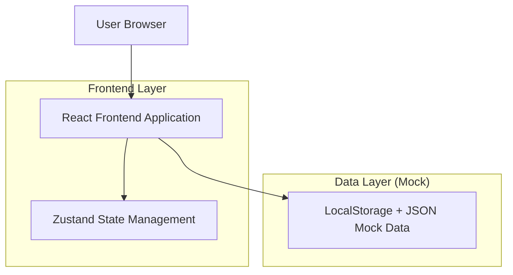
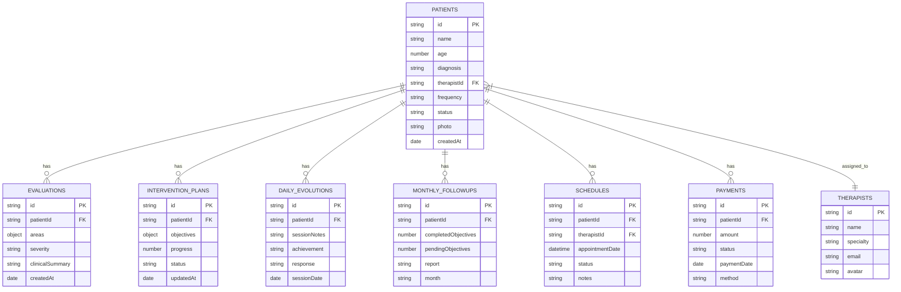

## 1. Architecture design

## 2. Technology Description
- Frontend: React@18 + JSX + TailwindCSS@3 + Vite
- Initialization Tool: vite-init
- Routing: React Router DOM@6
- Animations: Framer Motion@10
- State Management: Zustand@4
- Forms: React Hook Form@7
- Icons: Lucide React
- Charts: Recharts@2
- Date Handling: date-fns@3
- Backend: None (mock JSON + LocalStorage)
- Database: None

## 3. Route definitions
| Route | Purpose |
|-------|---------|
| / | Dashboard principal con estadísticas generales y actividad reciente |
| /patients | Lista de pacientes con búsqueda, filtros y vistas alternativas |
| /patients/:id | Perfil detallado del paciente con expediente clínico completo |
| /evaluations | Módulo de evaluaciones terapéuticas estructuradas |
| /intervention-plans | Planes de intervención visuales tipo kanban |
| /daily-evolution | Registro rápido de evoluciones diarias de sesiones |
| /monthly-followups | Seguimientos mensuales con reportes comparativos |
| /schedule | Agenda terapéutica con calendario interactivo |
| /payments | Módulo financiero de pagos y facturación |
| /reports | Dashboard de reportes y métricas analíticas |
| /settings | Configuraciones de la aplicación y perfil de usuario |

## 4. Data model
### 4.1 Data model definition

### 4.2 Mock JSON Files Structure
Archivos de datos mock ubicados en `/src/data/`:
- `patients.json`: Datos de pacientes con información clínica básica
- `therapists.json`: Información de terapeutas del consultorio
- `evaluations.json`: Evaluaciones terapéuticas registradas
- `interventionPlans.json`: Planes de intervención activos
- `dailyEvolutions.json`: Registros de evoluciones diarias
- `monthlyFollowups.json`: Seguimientos mensuales completados
- `schedules.json`: Citas y agenda terapéutica
- `payments.json`: Transacciones y registros de pagos

Todos los datos se cargan al inicio y se sincronizan con LocalStorage para simular persistencia sin backend real.
